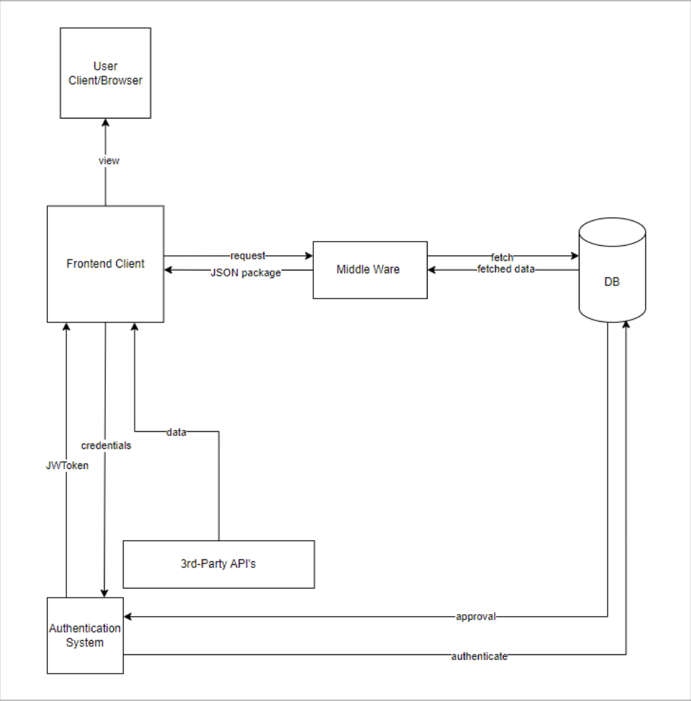

# Nimbus Online Banking Services

## Motivation

 
One of the best things about software is that they can make our lives more efficient and are accessible from virtually anywhere with the right device. Going to a traditional bank in person can be a time-consuming task as a result of long lines and having to communicate with employees. In addition, services such as opening an account or larger fiscal transfers may take longer due to substantial paperwork and in-person processing. It becomes even harder to access for those who may not have reliable transportation, have certain health issues, or live too far to travel to a bank. Operating a bank also incurs significant costs and demands human resources and time. Our solution of an online-only bank would increase the accessibility of banking services for customers and reduce operation costs for employees and managers. Our software’s key features, constraints, and objectives are described below.

## Solution

## Showcase

## Credits
